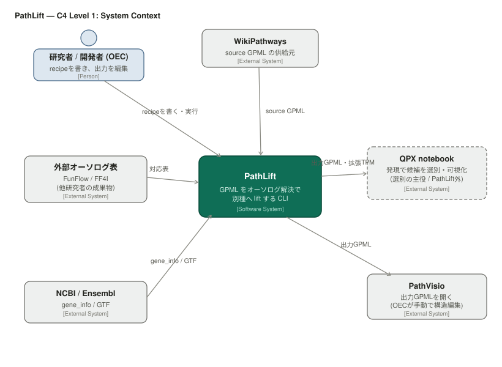
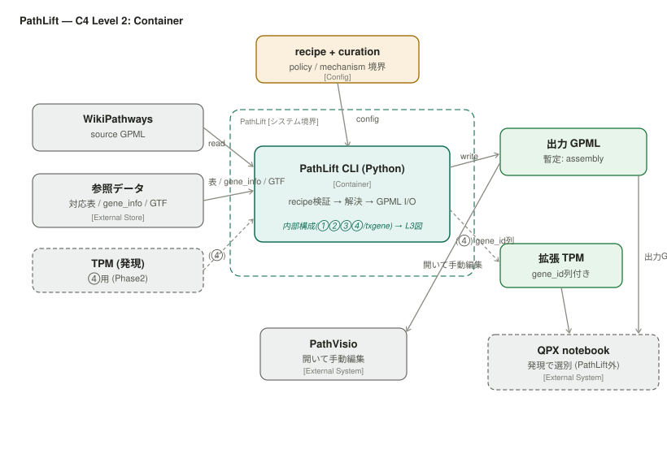
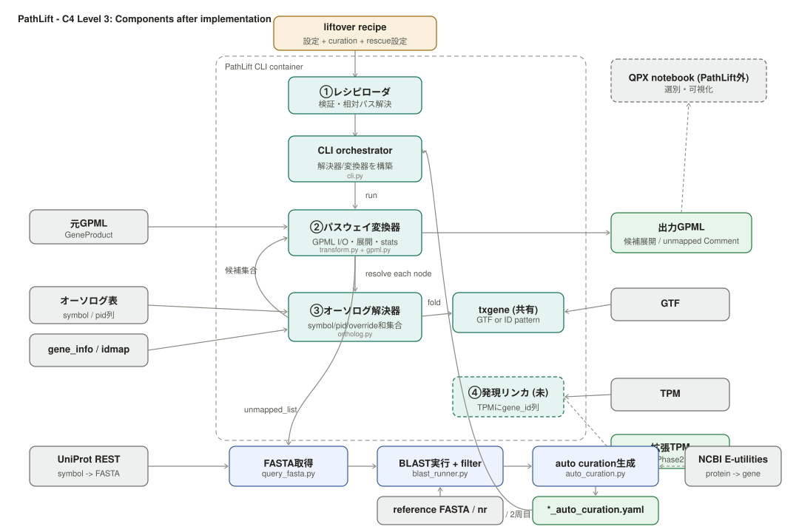

# PathLift C4 モデル

> PathLift の構成を C4 でトップダウンに記す（L1 文脈 → L2 コンテナ → L3 コンポーネント）。
> 旧 `仕様検討/c4_model_draft.md` を supersede。根拠は `PoC知見と設計判断.md`。
>
> 図：`pathlift_c4_l1_context.svg` / `pathlift_c4_l2_container.svg` / `pathlift_c4_l3_after_implementation.svg`

PathLift は単一の CLI ツールなので、L2（コンテナ）は薄い。だが L1 で「誰のために・何と接するか」、L3 で「中身」を示し、L2 がその橋渡しをすることで、全体がトップダウンに読める。

---

## Level 1 — System Context

図：

PathLift を中心に、利用者と外部システムの関係を示す。

- **研究者 / 開発者 (OEC)** … recipe を書いて PathLift を実行し、出力 GPML を PathVisio で手動編集する利用者。
- **WikiPathways** … source GPML の供給元。
- **外部オーソログ表 (FunFlow / FF4I)** … 他研究者の成果物。PathLift の解決の素。
- **NCBI / Ensembl** … gene_info・GTF の供給元。
- **QPX notebook** … 下流。出力 GPML と拡張 TPM を受け、発現で候補を選別・可視化する。**選別の主役は PathLift の外**。
- **PathVisio** … 出力 GPML を開く手動編集環境。

ここで読み取るべき設計上の境界は、**「lift（PathLift）」と「選別（QPX notebook）」が別システムに分かれている**こと。PathLift は recall 優先で全候補を出すところまでで、precision（偽陽性の除去）は外部に委ねる。この分割は PoC で確定した（`PoC知見と設計判断.md` C-3）。

---

## Level 2 — Container

図：

PathLift システム境界の中身は、**CLI ツール (Python) 1 コンテナ**。

- **recipe + curation**（設定）が policy/mechanism の境界として、CLI に config を渡す。
- CLI は外部ストア（source GPML / 対応表 / gene_info / GTF / reference FASTA）を読み、**出力 GPML** を書く。
- 通常解決（①②③）後も unmapped が残る場合、CLI は追加で **自動キュレーション／BLASTレスキュー**（UniProt REST でFASTA取得 → blastp（ローカル reference FASTA または NCBI nr remote）→ override 自動生成 → curation を差し替えて再解決）を行う。`ortholog_resolver.routes.compute` の実装（2026-07、L3参照）。**既知のギャップ**：現状は`routes.compute`フラグや`compute_fallback.blastp`の閾値を参照せず常時発動する（`pathway-liftover-spec.md` §8）。
- 将来の **TPM → 拡張 TPM**（④の経路）は破線（Phase2）。
- 出力 GPML は **PathVisio**（手動編集）と **QPX notebook**（選別）へ、拡張 TPM は QPX へ流れる。

コンテナが1つなので L2 は L3 と情報が重なる。詳細な内部構成（①②③④ と txgene）は L3 へズームインする。

---

## Level 3 — Component

図：

CLI コンテナの内部コンポーネント。実装と PoC を反映済み。

| # | コンポーネント | 責務 |
|---|---|---|
| ① | レシピローダ（`recipe.py`） | recipe を検証し config を返す。失敗ならランタイムに入れない |
| ② | パスウェイ変換器（`transform.py` + `gpml.py`） | GPML I/O・全体主導・ノード展開・配置 |
| ③ | オーソログ解決器（`ortholog.py`） | source ノード→候補集合（provenance付き）。絞らず全候補 |
| ④ | 発現リンカ（**未実装**） | TPM に gene_id 列を足すだけの薄い役 |
| ⑤ | 自動キュレーション／BLASTレスキュー（`query_fasta.py` + `blast_runner.py` + `auto_curation.py`） | **実装済**（2026-07）。③の後、unmapped が残れば UniProt からFASTA取得→blastp→override自動生成→curation差し替えの上で③④サイクルを再実行。`compute`ルートの実体。CLI（`cli.py`）が直接オーケストレーションする |
| 共有 | txgene（`txgene.py`） | transcript→gene 畳み込み。GTF or パターン。③⑤（将来④）が共有 |
| — | models（`models.py`） | データ構造（候補・解決結果・Route 等） |

L3 で実装上確定した3点：

1. **txgene は GTF の辺ではなく独立コンポーネント**。GTF はそれが読む元ストアで、無ければパターン畳みに落ちる。
2. **④の責務が縮小**し「TPM に gene_id 列を足すだけ」に。選別の主役は L1 の QPX notebook へ移った。②からの呼び出しは無い。
3. **`compute`ルートは⑤として独立コンポーネントで実装された**（③内のインライン処理ではない）。候補は`Route.OVERRIDE`として記録され、`models.Route.COMPUTE`は現状未使用。また⑤は`ortholog_resolver.routes.compute`/`compute_fallback.blastp`を参照せず常時発動する既知のギャップがある（`pathway-liftover-spec.md` §8、`recipe.schema.md`）。

詳細は SVG を参照。境界（recipe）の妥当性は `PoC知見と設計判断.md` B章、各コンポーネントの挙動は `pathway-liftover-spec.md` を見よ。
