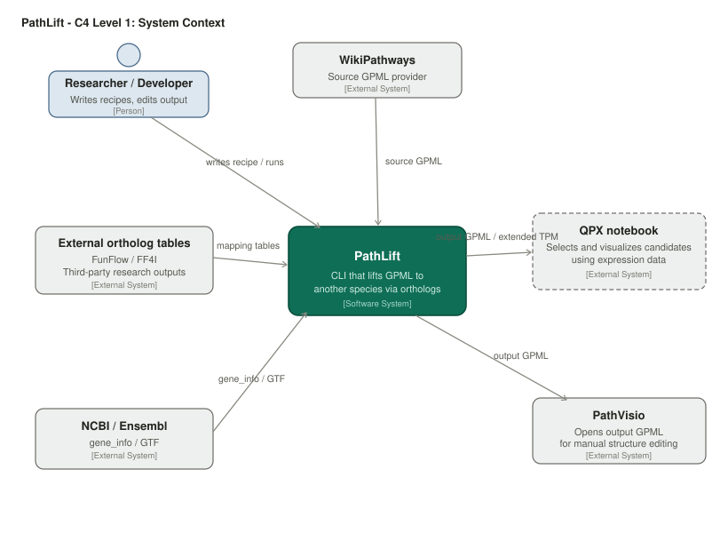
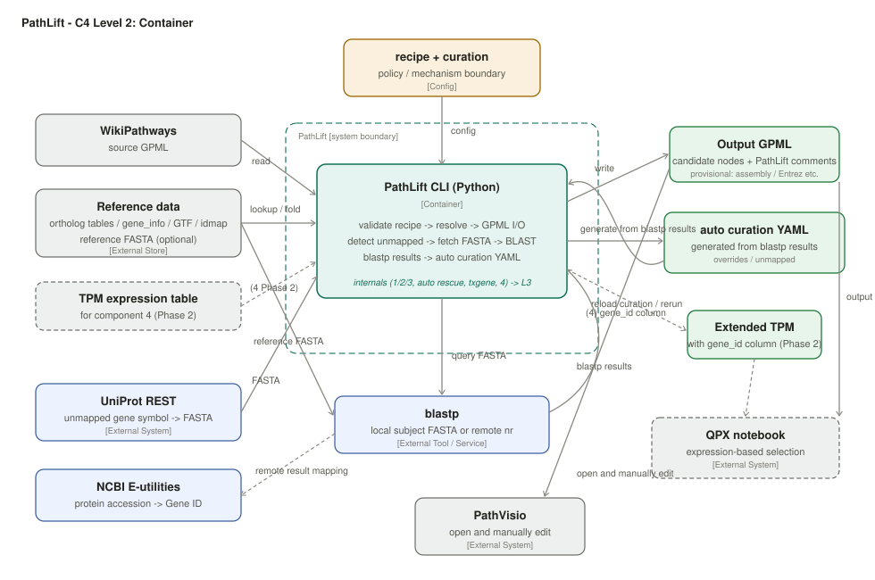
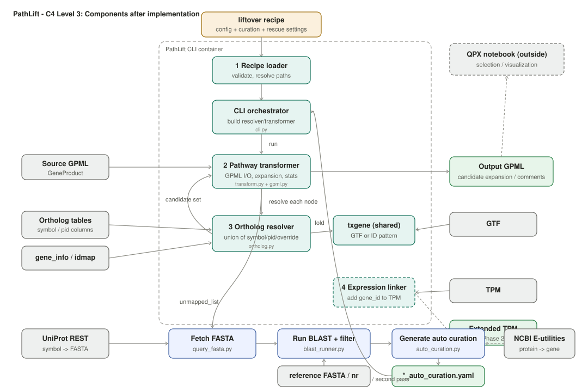

# PathLift C4 Model

> A top-down C4 description of PathLift: Level 1 System Context -> Level 2 Container -> Level 3 Components.
> This document is an English translation of `c4_model.md` for external communication.
> The normative Japanese design documents remain the source of truth.
>
> Diagrams: `pathlift_c4_l1_context_en.svg` / `pathlift_c4_l2_container_en.svg` / `pathlift_c4_l3_after_implementation_en.svg`

PathLift is a single CLI tool, so the Level 2 container view is intentionally thin. Level 1 explains who uses the tool and what external systems it touches, Level 3 explains the internal components, and Level 2 connects those two views.

---

## Level 1 - System Context

Diagram: 

This view shows the relationships between PathLift, its users, and external systems.

- **Researcher / Developer (OEC)** writes recipes, runs PathLift, and manually edits the output GPML in PathVisio.
- **WikiPathways** provides the source GPML.
- **External ortholog tables (FunFlow / FF4I)** are third-party research outputs used as resolution inputs.
- **NCBI / Ensembl** provide `gene_info` and GTF data.
- **QPX notebook** is downstream. It receives output GPML and extended TPM, then filters and visualizes candidates using expression data. **Candidate selection is outside PathLift.**
- **PathVisio** is the manual editing environment for the output GPML.

The key design boundary is that **lifting/conversion (PathLift)** and **candidate selection (QPX notebook)** are separate systems. PathLift prioritizes recall and emits all candidate mappings; precision-oriented filtering is delegated downstream. This split was confirmed by the PoC findings (`PoC知見と設計判断.md` C-3).

---

## Level 2 - Container

Diagram: 

Inside the PathLift system boundary there is **one container: a Python CLI tool**.

- **recipe + curation** acts as the policy/mechanism boundary and passes validated configuration to the CLI.
- The CLI reads external stores (source GPML, ortholog tables, `gene_info`, GTF, reference FASTA) and writes **output GPML**.
- If unmapped nodes remain after normal resolution routes (1, 2, 3), the CLI can run **auto curation / BLAST rescue**: fetch FASTA via UniProt REST -> run `blastp` against a local reference FASTA or remote NCBI nr -> generate overrides -> reload curation -> resolve again. This is implemented in `ortholog_resolver.routes.compute` behavior as of 2026-07; see L3. **Known gap:** the current implementation does not yet honor the `routes.compute` flag or `compute_fallback.blastp` thresholds and currently runs this path unconditionally (`pathway-liftover-spec.md` section 8).
- The future **TPM -> extended TPM** path is shown as dashed Phase 2 work.
- Output GPML flows to **PathVisio** for manual editing and **QPX notebook** for selection; extended TPM flows to QPX.

Because there is only one container, Level 2 overlaps with Level 3. The internal components and the 1/2/3/4 routes plus `txgene` are shown in Level 3.

---

## Level 3 - Component

Diagram: 

Internal components of the CLI container, reflecting the implementation and PoC findings.

| # | Component | Responsibility |
|---|---|---|
| 1 | Recipe loader (`recipe.py`) | Validates a recipe and returns config. If validation fails, runtime conversion does not start. |
| 2 | Pathway transformer (`transform.py` + `gpml.py`) | GPML I/O, overall orchestration, node expansion, and layout. |
| 3 | Ortholog resolver (`ortholog.py`) | Maps source nodes to candidate sets with provenance. It emits the full union of candidates, without filtering. |
| 4 | Expression linker (**not implemented**) | Thin Phase 2 role: add a `gene_id` column to TPM. |
| 5 | Auto curation / BLAST rescue (`query_fasta.py` + `blast_runner.py` + `auto_curation.py`) | **Implemented** as of 2026-07. If unmapped nodes remain after component 3, fetch FASTA from UniProt, run `blastp`, generate overrides, reload curation, and rerun the 3/4 cycle. This is orchestrated directly by the CLI (`cli.py`). |
| Shared | txgene (`txgene.py`) | Transcript-to-gene folding using GTF or an ID pattern. Shared by 3 and 5, and later by 4. |
| - | models (`models.py`) | Data structures for candidates, resolution results, routes, and related records. |

Three implementation decisions are fixed in Level 3:

1. **`txgene` is an independent component, not an edge from GTF.** GTF is an input store read by `txgene`; if GTF is absent, PathLift falls back to pattern-based folding.
2. **Component 4 has a reduced responsibility:** it only adds a `gene_id` column to TPM. Candidate selection moved to the QPX notebook shown in Level 1. It is not called by component 2.
3. **The `compute` route is implemented as component 5**, not as inline logic inside component 3. Candidates are recorded as `Route.OVERRIDE`; `models.Route.COMPUTE` is currently unused. Component 5 also has a known gap: it currently ignores `ortholog_resolver.routes.compute` and `compute_fallback.blastp` settings and runs unconditionally (`pathway-liftover-spec.md` section 8, `recipe.schema.md`).

See the SVG diagrams for details. The rationale for the recipe boundary is in `PoC知見と設計判断.md` chapter B, and component behavior is specified in `pathway-liftover-spec.md`.
