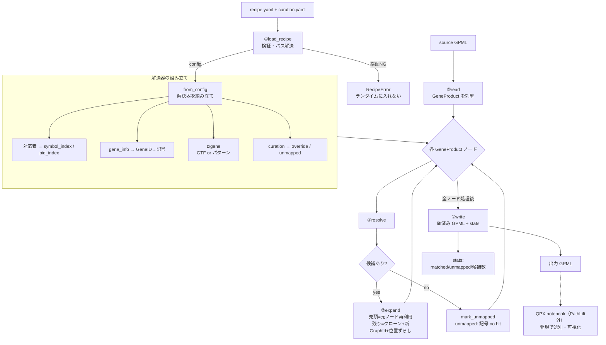
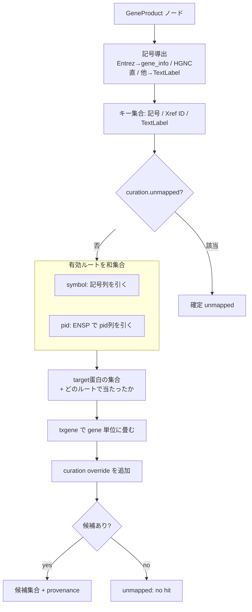

# PathLift 変換フロー（conversion_flow）

> ランタイムの処理フロー。PoC で確認した実際の流れに合わせてある。
> 色は `開発管理/mermaid_color_legend.md` の凡例を適用する。
> 構成（コンポーネント）は `c4_model.md`、根拠は `PoC知見と設計判断.md`。

## 1. 全体フロー

## 2. resolve の内部（③）

## 3. フローに表れる設計上の要点

- **検証は前段で完結**（`load_recipe`）。ランタイムはパス探索も判定もしない。
- **解決は全候補・和集合**。絞らない（recall 優先）。選別は QPX notebook（PathLift 外）。
- **記号導出は IDタイプ依存**で、非 Entrez/HGNC は TextLabel に落ちる（`PoC知見と設計判断.md` E章）。
- **txgene は GTF/パターンの2モード**で、選択はアセット依存（同 F章）。
- **MISS の主因はパラログ×表カーディナリティ**。`compute` ルート（未実装）がこのフローの `HITS` を補完して recall を回収する位置づけ（同 C-3）。
