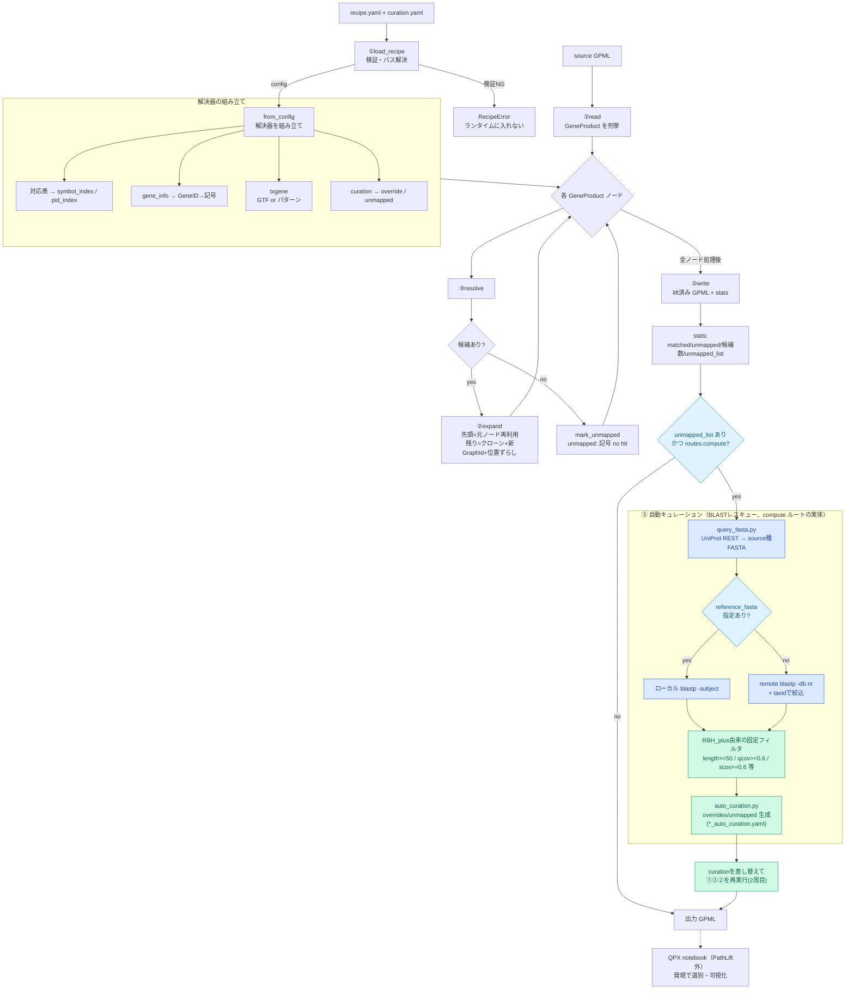
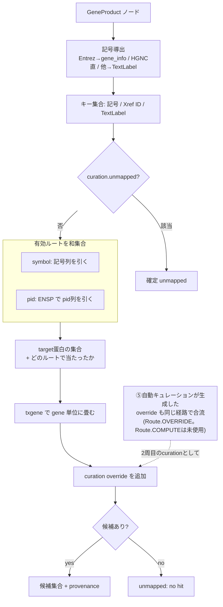

# PathLift 実行時フロー・分岐仕様（runtime_flow_and_branching）

> ランタイムの処理フローと、recipe/実行時データによる**分岐**（`routes.compute`・`reference_fasta`有無等）。
> C4のL2/L3が構造（何が存在し何をするか）を示すのに対し、本ファイルは「設定・実行時データに
> よってどの経路が発火するか」を示す。旧ファイル名 `conversion_flow.md`（2026-07-11改名）。
> 色は `開発管理/mermaid_color_legend.md` の凡例を適用する。
> 構成（コンポーネント）は `c4_model.md`、根拠は `PoC知見と設計判断.md`。

## 1. 全体フロー

> `routes.compute=false`（既定）なら`CCHK`は`no`に固定され、⑤は一切発火しない。
> `reference_fasta`は`RCHK`の分岐にのみ関わり、`compute`ルートのon/off自体は左右しない。

## 2. resolve の内部（③）

> ⑤（BLASTレスキュー）は resolve() の内部処理ではなく、CLI（`cli.py`）が stats 確認後に
> curation を差し替えて①③②全体をもう一周させる形で実装されている（上記1.参照）。
> resolve() 自身にとっては「override が増えた2周目」でしかなく、compute専用の分岐は無い。

## 3. フローに表れる設計上の要点

- **検証は前段で完結**（`load_recipe`）。ランタイムはパス探索も判定もしない。
- **解決は全候補・和集合**。絞らない（recall 優先）。選別は QPX notebook（PathLift 外）。
- **記号導出は IDタイプ依存**で、非 Entrez/HGNC は TextLabel に落ちる（`PoC知見と設計判断.md` E章）。
- **txgene は GTF/パターンの2モード**で、選択はアセット依存（同 F章）。
- **MISS の主因はパラログ×表カーディナリティ**。`compute` ルート（⑤自動キュレーション、2026-07実装）が、`HITS`ではなくstats確認後の**2周目**としてrecallを回収する位置づけ（同 C-3）。フィルタはRBH_plus由来の固定ロジックで、recipeでは`evalue`のみ調整可能（`pathway-liftover-spec.md` §8、`recipe.schema.md`）。
- **`routes.compute`はunmapped発生後の分岐そのもの**（上記1.の`CCHK`）であり、`reference_fasta`有無は⑤内部のローカル/リモートblastp分岐（`RCHK`）にのみ関わる。両者を混同しないこと。
