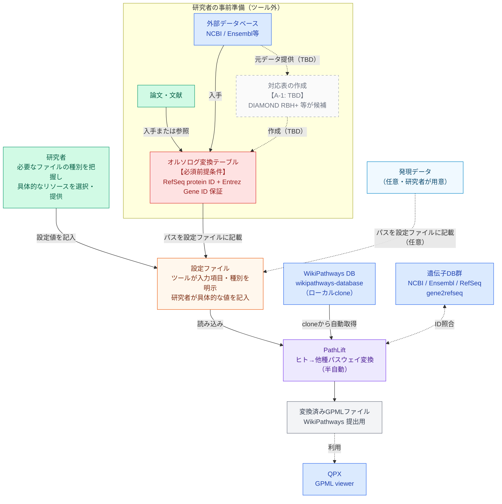
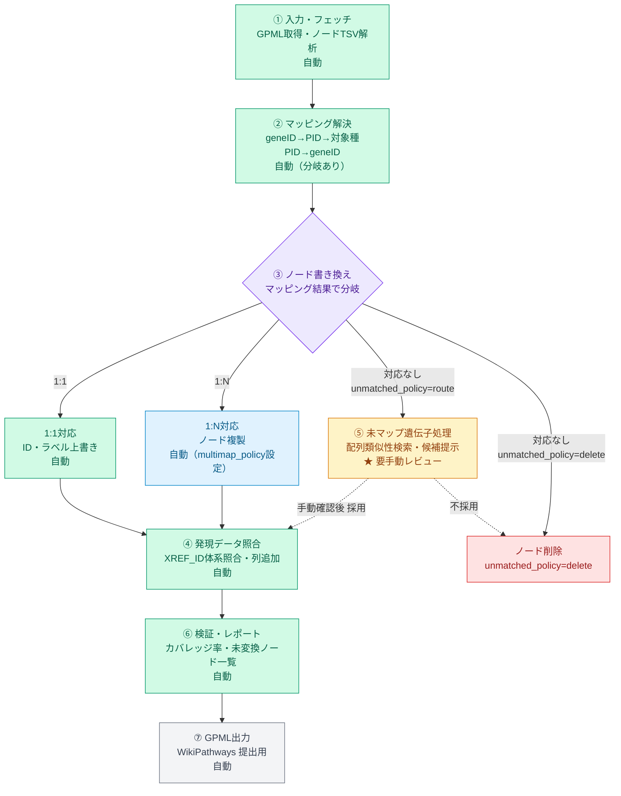
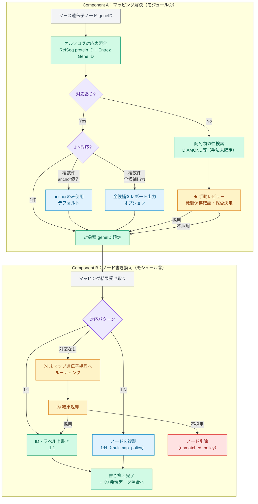

# パスウェイのliftover自動化ツール検討：　林さんのLift over仕様書（pathway-liftover-spec）を元にC4モデルの設計書の叩き台を考える

仕様書を読み込みリフトオーバーワークフローの性質をよく理解した上で、C4モデル風に整理します。

C4モデルは本来4階層（Context → Container → Component → Code）ですが、今回はツール設計の検討段階なので **Context・Container・Component** の3層で構造化し、分岐ポイントや外部リソース依存も明示します。では、C4モデル風の仕様図を3層に分けて描きます。

**Level 1 (Context)** — システム全体と外部アクターの関係

> 2026-06-01更新：A-3（研究者の責務範囲）・A-5（GPMLファイル取得方法）を反映。A-1（対応表作成手法）はTBD。

**Level 2 (Container)** — ツール内部の処理パイプライン

**Level 3 (Component)** — マッピング解決（Component A）とノード書き換え（Component B）の内部ロジック

テキスト仕様のまとめです。

---

## ツール仕様まとめ（C4モデル準拠）

Pathliftはヒトなどの既存のWikiPathwaysのGPMLを入力として、目的の他種の遺伝子をパスウェイのGeneProductノードにマッピングし目的の種のパスウェイとしてGPMLを出力するツールです。合わせてオプションとして、QPXでパスウェイと協調的に表示する発現テーブルへのキー列の確認・追加などの編集機能も提供する。

### Level 1 — Context（システム文脈）

> 2026-06-01更新：A-3・A-5確定。A-1はTBD。

**【GPMLファイルの取得：A-5確定】** WikiPathwaysのGPMLはGitHubリポジトリ（`wikipathways/wikipathways-database`）をローカルにcloneして利用する。パスウェイごとにディレクトリが存在し、`*.gpml`本体とアノテーションtsvが含まれる。cloneを最新状態に維持（pull）することで常に最新リソースを参照できる。

**【研究者とシステムの責務分担：A-3確定】**
- **研究者の責務：** 具体的にどのファイルを使うかの判断・選択・提供。既存の遺伝子対応表の選択など、研究者の知見に基づく部分であり機械的な自動化が難しい。研究者は設定ファイルに必要な値を記入することでツールに入力を渡す。
- **システムの責務：** どのタイプのファイルが必要かを研究者に明示すること。設定ファイルの設計（入力項目・種別・説明の充実）を通じて、研究者が迷わず入力できるようにする。不足・不整合があればわかりやすいエラーを返す。

**【必須前提条件】オルソログ変換テーブル（ヒト→対象種の遺伝子ID対応表）が事前に用意されていることが、本ツール動作の必須条件である。** このテーブルが存在しない場合、マッピング解決処理を実行できない。

**【オルソログ変換テーブルの構造】** テーブルはRefSeqタンパク質ID（NP_xxx）とEntrez Gene IDの両方を保証する列構成とする。RefSeq→Entrez Gene IDの変換にはgene2refseqを使用する（NCBI公式の対応テーブルであり最もカバレッジが高い）。テーブルが保証するのはEntrez Gene IDまでであり、発現テーブルとのXREF_ID照合はモジュール④が担う（発現テーブルのID体系は研究対象の生物種によって異なるため、テーブル自体には固定しない）。1:N対応（in-paralogや同一遺伝子の複数アイソフォーム）が存在する場合の扱いはLevel 3の分岐ポイント2を参照。

**【オルソログ変換テーブルの作成：A-1 TBD】** ヒト対非モデル生物では対応表が存在しないのが通常のため、ツールのオプション機能として作成支援を組み込む方向。サポートする手法（DIAMOND RBH+ 等）のリストは打ち合わせ後に確定する。

研究者が設定ファイルに**生物種・PathwayID（またはバッチ指定）・オルソログ変換テーブルパス・発現データパス（任意）**等を記入して実行すると、ツールがWikiPathwaysのローカルcloneからGPMLを取得し、遺伝子DB群（NCBI/Ensembl/RefSeq）および発現データ（任意）と連携して変換済みGPMLを出力する。オルソログ変換テーブルでカバーできない遺伝子については配列類似性検索（手法未確定、DIAMOND等が候補）を用い、その結果確認のみ手動介入が入る。

TODO: 手動介入の範囲要検証（ノード書き換えが手動になる可能性あり。バイトスタッフへの確認が必要）【A-2・B-2】
TODO: 配列類似性検索の手法確定（DIAMOND等、仕様書では抽象化しておくか特定ツールに確定するか）【A-1】
TODO: オルソログ変換テーブルが存在しない場合のフロー未定（fanflow等への誘導、またはエラー終了）【A-7】

---

### Level 2 — Container（処理パイプライン）

| # | モジュール | 処理概要 | 自動/手動 |
|---|-----------|---------|----------|
| ① | 入力・フェッチ | WikiPathwaysからGPML取得、ノードTSV解析 | 自動 |
| ② | マッピング解決 | geneID→PID→対象種PID→geneID変換 | 自動（分岐あり） |
| ③ | ノード書き換え | マッピング結果に基づきGeneProductノードのIdentifier / Database / Text Labelを更新。1:N対応の場合はノードを複製、対応なしの場合はノードを削除または⑤へルーティング（設定による） | 自動（分岐あり） |
| ④ | 発現データ照合 | GPMLノードのXREF_IDと発現テーブルのID体系を照合し、対応列が存在しなければ追加する。XREF_IDの体系は生物種・プロジェクトにより異なる（Entrez Gene ID以外の特殊IDも含む）ため、本モジュールが吸収する | 自動 |
| ⑤ | 未マップ遺伝子処理 | 配列類似性検索・候補提示 | **要手動レビュー** |
| ⑥ | 検証・レポート | カバレッジ率・未変換ノード一覧出力 | 自動 |
| ⑦ | GPML出力 | 投稿用ファイル生成 | 自動 |

TODO: 全体的に要検証. これでモジュールが十分か？自動化部分は本当に自動化可能か？
TODO: ノードの置き換えは手動になのではと思う（バイトの皆さんに確認する）。自動化が難しい部分と思うので
xmlの編集
---

### Level 3 — Component A：マッピング解決（モジュール②）の内部ロジック

**設定として外部化すべきパラメータ（分岐の起点）：**

- `organism`：変換対象の生物種
- `pathway_id`：対象PathwayのID（複数・バッチ指定も想定）
- `ortholog_table`：オルソログ変換テーブルのファイルパス
- `expression_data`：発現データのファイルパス（任意）
- `identifier_priority`：geneID優先 or transcriptID許容
- `similarity_threshold`：配列類似性検索の採用閾値（e値・identity%、手法未確定）

**主な分岐ポイント：**

1. 対応表にヒットするか → Yes: 自動変換 / No: 配列類似性検索サブルーチンへ
2. ヒットが複数ある場合（1:N対応） → anchorのみ使用 / 全候補をレポートに出力して研究者が選択
   - 発生源①：in-paralog（DIAMOND RBH+の出力で1つのオルソロググループに複数メンバーが存在する場合）
   - 発生源②：タンパク質→遺伝子変換時（同一遺伝子の複数アイソフォームがNP_xxxを複数持つ場合）
   - デフォルト動作はanchor優先とし、全候補出力はオプションとする方向（未確定）
3. 類似性検索ヒットの機能保存が確認できるか → 手動確認後、採否をツールに返す
4. 発現データのIDが合わないか → 自動的に対応列を補完するか警告を出す

---

### Level 3 — Component B：ノード書き換え（モジュール③）の内部ロジック

**主な分岐ポイント：**

1. **1:1対応** → Identifier / Database / Text Labelを上書き（自動）
2. **1:N対応**（ヒトの1ノードが対象種の複数遺伝子に対応） → ノードを複製して全候補を配置 / anchorのみ使用（`multimap_policy`設定による、未確定）
3. **対応なし（マッピング解決でヒットなし）** → 配列類似性検索モジュール（⑤）へルーティング / ノード削除（`unmatched_policy`設定による、未確定）
4. **⑤からの結果返却** → 研究者が確認・採否を返した場合はそのIDでノード書き換え / 不採用・タイムアウトの場合はノードを削除またはフラグ付きで残す（未確定）

**TODO:** ノード書き換えの自動化可否（XML操作の実現性）はB-2で確認が必要。自動化が困難な場合、本コンポーネントの分岐ロジックが全面的に変わる可能性がある。

---

### 設計上の重要な判断点

**「半自動」の境界線**として、配列類似性検索ヒット後の機能確認だけは自動化せず、レビュー用の出力（ヒット配列・スコア・既知機能の注釈）を整形して研究者に提示する設計が現実的です。それ以外のステップは設定ファイル（YAMLやTSV）さえ用意すれば全自動化できます。

実装言語の候補としては、GPML操作・APIアクセス・ファイル処理を一括でこなせるPythonが最も適合します。次のステップとして、特定のモジュールの詳細設計や実装から始めたい部分があればお知らせください。

### 追記：関係者による現時点の印象のメモ

- 
