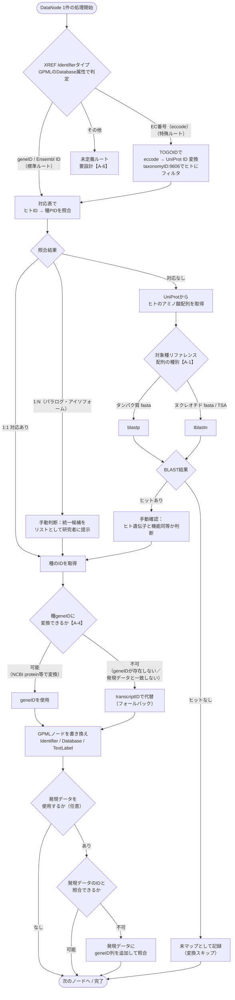

# 変換フロー分岐ダイアグラム（作業版）

PoCの観察（ミツバチ・カイコ）をもとに、ノード1件あたりの変換フローを整理する。
どこが共通でどこが分岐するかを可視化することで、A-2・A-4・A-6の設計判断の基盤とする。

確定後は`設計資料/`直下の正本に移動する。

---

## フローの対象範囲

- **入力：** WikiPathways GPMLパスウェイ（ヒト）の各DataNode
- **出力：** DataNodeに書き込む対象種のID（geneID優先、transcriptID許容）
- **ループ単位：** DataNode 1件ごとに以下のフローを実行する

---

## 変換フロー図

---

## 補足：NCBIのID同士で直接対応できる場合

上図の「対応表でヒトID → 種PIDを照合」の箇所は、対応表の中身によって処理が変わる。

| 対応表の型 | ヒト側キー | 種側の値 | 変換ステップ |
|-----------|-----------|---------|-------------|
| **標準型**（PoC実績） | Ensembl protein ID（ENSP*） | 種固有PID（MSTRG*等） | 種PID → geneID変換が別途必要 |
| **NCBI直接型**（未確認） | Entrez Gene IDまたはRefSeq NP_xxx | 種のEntrez Gene ID | geneIDがそのまま得られる（変換不要） |
| **fanflow出力型** | Ensembl protein ID | 複数種のPIDを1テーブルに収録 | 上記「標準型」と同様の変換が必要 |

「NCBI直接型」が実際に存在するかはPoC未確認。A-4の設計判断で整理する。

---

## 主要な分岐点の一覧

| 分岐ID | 条件 | 選択肢 | 関連TODO |
|--------|------|--------|---------|
| D-1 | GPMLのIdentifierタイプ | geneID/Ensembl ID / EC番号 / その他 | A-6 |
| D-2 | 対応表での照合結果 | 1:1 / 1:N（パラログ） / 対応なし | A-4 |
| D-3 | BLASTリファレンス種別 | タンパク質fasta / ヌクレオチドfasta(TSA) | A-1 |
| D-4 | BLAST結果 | ヒットあり / ヒットなし | A-2 |
| D-5 | 種geneIDへの変換可否 | 可能 / 不可（transcriptIDで代替） | A-4, A-6 |
| D-6 | 発現データとのID照合 | 一致 / 不一致（列追加） | A-6 |

---

## 手動介入が必要なポイント

| ステップ | 手動介入の内容 | 自動化の可否 |
|---------|--------------|-------------|
| D-2（1:N） | パラログ統一：どの遺伝子を代表として使うか選択 | 困難（生物学的判断が必要） |
| D-4（ヒットあり） | BLAST結果の機能同等性確認 | 困難（機能アノテーション確認が必要） |
| D-2（対応なし）→D-4（ヒットなし） | 未マップ遺伝子の最終扱いを決定 | 困難（研究者の判断が必要） |
| REWRITE | PathVisio等でのGPMLノード編集 | 要確認【B-2】 |

---

## 未解決・要設計の箇所

- **D-1「その他」ルート：** EC番号以外の特殊Identifierタイプへの対応は未設計。
- **対応表の型の自動判定：** ツールが対応表の型（標準型/NCBI直接型/fanflow出力型）を自動で識別できるか、または設定ファイルで指定させるかは未決（A-6）。
- **ノード書き換えの自動化：** PathVisioを使った手動編集を自動化できるかは未確認（B-2）。
