# パスウェイのliftover自動化ツール検討：　林さんのLift over仕様書（pathway-liftover-spec）を元にClaude sonnet4.6に設計の叩き台を考えてもらった

仕様書を読み込みリフトオーバーワークフローの性質をよく理解した上で、C4モデル風に整理します。

C4モデルは本来4階層（Context → Container → Component → Code）ですが、今回はツール設計の検討段階なので **Context・Container・Component** の3層で構造化し、分岐ポイントや外部リソース依存も明示します。では、C4モデル風の仕様図を3層に分けて描きます。

**Level 1 (Context)** から順に見ていきましょう。まずシステム全体と外部アクターの関係から。

次に **Level 2 (Container)**：ツールの内部構成と処理パイプラインです。

最後に **Level 3 (Component)**：マッピング解決モジュール（最も複雑な内部ロジック）の詳細です。---

図の補足と、テキスト仕様のまとめです。

---

## ツール仕様まとめ（C4モデル準拠）

Pathliftはヒトなどの既存のWikiPathwaysのGPMLを入力として、目的の他種の遺伝子をパスウェイのGeneProductノードにマッピングし目的の種のパスウェイとしてGPMLを出力するツールです。合わせてオプションとして、QPXでパスウェイと協調的に表示する発現テーブルへのキー列の確認・追加などの編集機能も提供する。

### Level 1 — Context（システム文脈）

**【必須前提条件】オルソログ変換テーブル（ヒト→対象種の遺伝子ID対応表）が事前に用意されていることが、本ツール動作の必須条件である。** このテーブルが存在しない場合、マッピング解決処理を実行できない。

研究者が**生物種・Pathway ID（またはバッチ指定）・オルソログ変換テーブルパス・発現データパス（任意）**を与えると、ツールがWikiPathwaysからGPMLを取得し、遺伝子DB群（NCBI/Ensembl/RefSeq）および発現データ（任意）と連携して変換済みGPMLを出力する。オルソログ変換テーブルでカバーできない遺伝子については配列類似性検索（手法未確定、DIAMOND等が候補）を用い、その結果確認のみ手動介入が入る。発現データとの照合はオプション操作であり、GPMLノードのXREF_IDと同タイプのID列が発現テーブルに存在するか確認し、なければ列を追加する。

TODO: 手動介入の範囲要検証（ノード書き換えが手動になる可能性あり。バイトスタッフへの確認が必要）
TODO: 配列類似性検索の手法確定（DIAMOND等、仕様書では抽象化しておくか特定ツールに確定するか）
TODO: オルソログ変換テーブルが存在しない場合のフロー未定（fanflow等への誘導、またはエラー終了）

---

### Level 2 — Container（処理パイプライン）

| # | モジュール | 処理概要 | 自動/手動 |
|---|-----------|---------|----------|
| ① | 入力・フェッチ | WikiPathwaysからGPML取得、ノードTSV解析 | 自動 |
| ② | マッピング解決 | geneID→PID→対象種PID→geneID変換 | 自動（分岐あり） |
| ③ | ノード書き換え | Identifier / Database / Text Label更新 | 自動 |
| ④ | 発現データ照合 | ID対応確認、必要列追加 | 自動 |
| ⑤ | 未マップ遺伝子処理 | 配列類似性検索・候補提示 | **要手動レビュー** |
| ⑥ | 検証・レポート | カバレッジ率・未変換ノード一覧出力 | 自動 |
| ⑦ | GPML出力 | 投稿用ファイル生成 | 自動 |

TODO: 全体的に要検証. これでモジュールが十分か？自動化部分は本当に自動化可能か？
TODO: ノードの置き換えは手動になのではと思う（バイトの皆さんに確認する）。自動化が難しい部分と思うので
xmlの編集
---

### Level 3 — Component（マッピング解決の内部ロジック）

**設定として外部化すべきパラメータ（分岐の起点）：**

- `organism`：変換対象の生物種
- `pathway_id`：対象PathwayのID（複数・バッチ指定も想定）
- `ortholog_table`：オルソログ変換テーブルのファイルパス
- `expression_data`：発現データのファイルパス（任意）
- `identifier_priority`：geneID優先 or transcriptID許容
- `similarity_threshold`：配列類似性検索の採用閾値（e値・identity%、手法未確定）

**主な分岐ポイント：**

1. 対応表にヒットするか → Yes: 自動変換 / No: 配列類似性検索サブルーチンへ
2. 類似性検索ヒットの機能保存が確認できるか → 手動確認後、採否をツールに返す
3. 発現データのIDが合わないか → 自動的に対応列を補完するか警告を出す
---

### 設計上の重要な判断点

**「半自動」の境界線**として、配列類似性検索ヒット後の機能確認だけは自動化せず、レビュー用の出力（ヒット配列・スコア・既知機能の注釈）を整形して研究者に提示する設計が現実的です。それ以外のステップは設定ファイル（YAMLやTSV）さえ用意すれば全自動化できます。

実装言語の候補としては、GPML操作・APIアクセス・ファイル処理を一括でこなせるPythonが最も適合します。次のステップとして、特定のモジュールの詳細設計や実装から始めたい部分があればお知らせください。

### 追記：関係者による現時点の印象のメモ

- 
