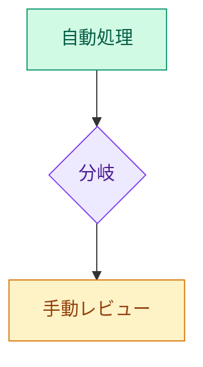

# Mermaidダイアグラム 色分け凡例

c4_model_draft.md（および将来の正本C4_model.md）で使用するMermaid図の色分けルール。
図を追加・更新する際はこの凡例に従い、`classDef` を各図の末尾に記載すること。

---

## 色の意味と適用対象

| クラス名 | 色 | 意味 | 適用対象の例 |
|---|---|---|---|
| `auto` | 🟢 緑 | 自動処理 | 自動モジュール（①②④⑥⑦）・変換ステップ・書き換え完了 |
| `manual` | 🟡 黄 | 要手動レビュー | ⑤未マップ遺伝子処理・手動確認ステップ・ルーティング・結果返却 |
| `config` | 🔵 水色 | 設定依存の分岐 | anchor優先/全候補出力・multimap_policy・unmatched_policy |
| `required` | 🔴 赤 | 必須前提条件 | オルソログ変換テーブル（L1） |
| `delete` | 🔴 赤 | 削除操作 | ノード削除（L2・L3） |
| `branch` | 🟣 紫 | 分岐ポイント | 菱形の判断ノード（「対応あり?」「1:N対応?」等） |
| `core` | 🟣 紫 | ツール本体 | Pathway Liftover Tool（L1） |
| `researcher` | 🟢 緑 | 研究者・研究者側リソース | 研究者アクター・論文（L1） |
| `external` | 🔵 青 | 外部システム | WikiPathways・遺伝子DB群・QPX（L1） |
| `optional` | 🔵 薄青 | 任意入力 | 発現データ（L1） |
| `input` | ⬜ グレー | 入力ノード | ソース遺伝子ノード・マッピング結果受け取り（L3） |
| `output` | ⬜ グレー | 出力ノード | 変換済みGPMLファイル・GPML出力モジュール |

---

## classDef テンプレート

図の末尾に貼り付けて使用する。

```
classDef auto      fill:#d1fae5,stroke:#059669,color:#065f46
classDef manual    fill:#fef3c7,stroke:#d97706,color:#92400e
classDef config    fill:#e0f2fe,stroke:#0284c7,color:#075985
classDef required  fill:#fee2e2,stroke:#dc2626,color:#991b1b
classDef delete    fill:#fee2e2,stroke:#dc2626,color:#991b1b
classDef branch    fill:#ede9fe,stroke:#7c3aed,color:#4c1d95
classDef core      fill:#ede9fe,stroke:#7c3aed,color:#4c1d95
classDef researcher fill:#d1fae5,stroke:#059669,color:#065f46
classDef external  fill:#dbeafe,stroke:#2563eb,color:#1e40af
classDef optional  fill:#f0f9ff,stroke:#0284c7,color:#0c4a6e
classDef input     fill:#f3f4f6,stroke:#6b7280,color:#374151
classDef output    fill:#f3f4f6,stroke:#6b7280,color:#374151
```

ノードへの適用は `:::クラス名` で行う。例：


